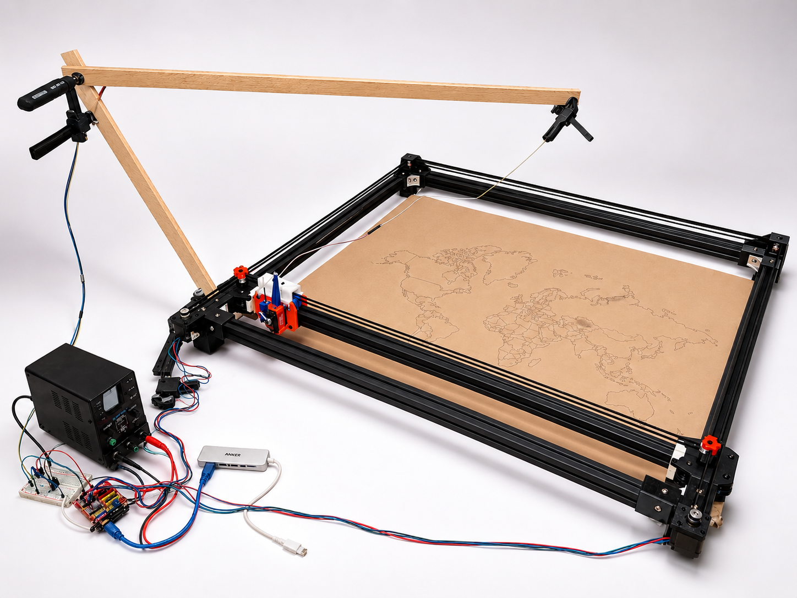

# CoreXY Pen Plotter

A large format Arduino based CoreXY pen plotter with a custom slicer app for turning digital artwork into physical drawings.

## Why This Exists

I intialliy built this beucase I got tired of having to hand trace digital drawings onto paper for art projects, and I wanted to build something that could not only accomodate large poster sizes but also do it with much more precision. So thats why I built this large CoreXY Plotter. I've seen a lot of plotters out there, but none are as big as what I've designed, nor are they as cheap as mine. Mine doens't use large expensive linear rails or flexible rods, but instead it uses rollers to utilize extrusions as the strong gantry while having customizeable sizes. It is mostly 3D printed parts or common hardware parts, no rare or expensive parts. It's rigidity allows it to draw even large desgisn with high precision and repeatability. It can accomodate both pen or pencil, so with more complex code it could probably imitate human handwriting, though obviously not 100%. The design is very human. 

## Photos And Demo

Main project photo:



Demo video:

[Plotter running demo video](photos/demo-plotter-running.mp4)

## What It Does

This project is meant to make large physical line drawings from normal digital
artwork without needing a commercial plotter or a bunch of expensive motion
hardware. The machine can be used on large poster sized paper, but can also be
configured to only draw on a mapped smaller size paper through the application.

The custom Plotter Studio app is the brain of the whole plotter. It allows you to import SVGs
or trace raster images, preview and adjust your drawing, then slice the plate into gcode
 and send it directly to the Arduino over USB. The device tab also replaces the usual pile of terminal commands with buttons for connection, manual homing, jogging, pen control, live
speed/accel tuning, job progress, and a small live job map.

The firmware is intentionally simple enough to run on an Arduino Uno, but still
handles the plotter's key features: CoreXY motor conversion, absolute gcode
movement, manual home confirmation, trapezoid style acceleration, task interjection,
servo pen up/down timing, and MOSFET controlled servo power to avoid the
boot twitch problem.

## How It Fits Together

The hardware is the large CoreXY frame, rollers, belts, gantry, and pen toolhead. 
The firmware is the real time layer that turns gcode into step pulses and pen movements. 
Plotter Studio is the computer side layer that turns art into motor instructions from user input.
The user imports art, fits it to the selected drawing area, generates gcode, provides the 
preview, and streams it to the Uno firmware.

## Build One

Start with the hardware docs:

- [Assembly guide](hardware/assembly.md)
- [Bill of materials](hardware/bom.md)
- Printable STL files in [hardware/exports/stl](hardware/exports/stl)
- Printable STEP files in [hardware/exports/step](hardware/exports/step)
- Full assembly STEP file in [hardware/exports/assembly](hardware/exports/assembly)

The CAD is also available in Onshape:

```text
https://cad.onshape.com/documents/21408afa0678dfc090a39137/w/cada99e8b20e026a88815622/e/614e2d6018b77ddf107765d2?renderMode=0&leftPanel=false&uiState=6a7a26314284ccba60f59ccc
```

After the hardware is assembled and wired, use
[Plotter Studio instructions](firmware/instructions.md) to upload the Arduino
firmware, launch the app, run first motion tests, align letter paper, import art,
slice the plate, and send drawings. The deeper firmware/app notes are in
[firmware/technical-notes.md](firmware/technical-notes.md).

## Repo Layout

```text
hardware/            assembly guide, BOM, exported CAD/STL files
firmware/            Arduino firmware, Plotter Studio app, scripts, examples
photos/              sample plots, wiring photos, demo video
```

Most readers should start with this README, then `hardware/assembly.md`, then
`hardware/bom.md`. The firmware internals are mostly for people changing code.

Generated local folders such as `.pio/`, `.venv/`, `.plotter-app/`, and
`Plotter Studio.app/` are not part of the source package.

## What I Would Do Differently

The biggest thing I would rethink is tolerance. This project made it really
obvious that CAD numbers and printed numbers are not the same thing, especially
with ABS. Warping can change dimensions enough that one part is too tight while
another part is too loose, even when they were designed with the same logic. The
toolhead is a little loose in some places, and that costs rigidity, which then
costs drawing precision.

The rollers also showed this problem. Some spin smoothly, some are too tight,
and some basically drag instead of rolling. After seeing the actual prints, I
started wondering if a sliding plastic block in the extrusion groove might have
been better than round rollers. A roller only touches at a tangent point, while a
printed rectangular slider could contact the extrusion in a more constrained and
repeatable way. It might even be more precise, as long as the friction is
manageable.

The belt clamp mount is another place where I designed the part first and
thought about assembly second. It works, but it was one of the hardest parts to
put together. If I rebuilt it, I would probably design more of that toolhead area
as one piece instead of splitting it into pieces just to avoid supports. I did
not trust support structures that much while designing this, but after printing
more parts, I am a lot more willing to use supports for harder shapes if it makes
the final assembly simpler and stiffer.

## License

This project is licensed under the MIT License. See `LICENSE`.
