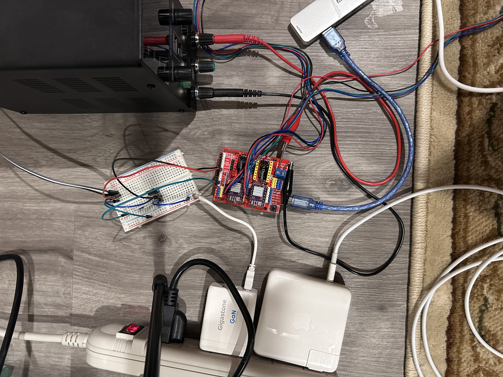
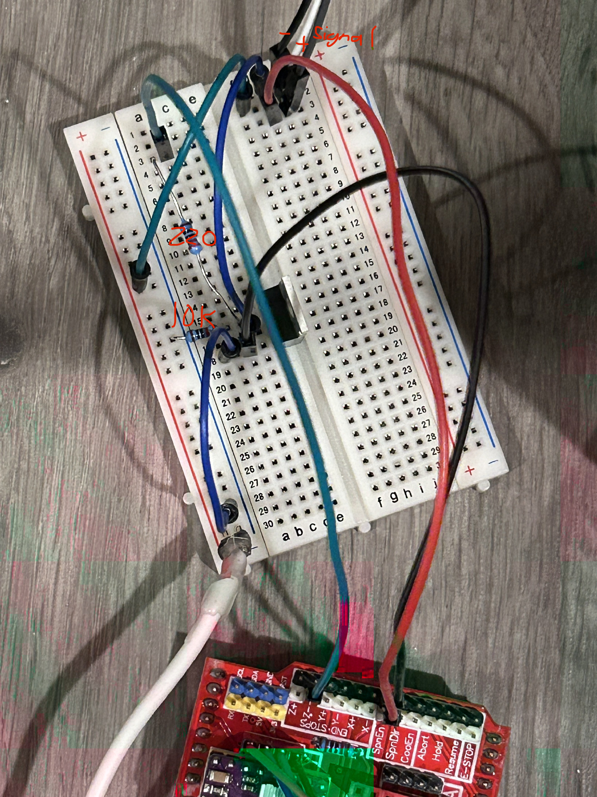

# Assembly Guide

This guide captures the current known-good build details for the CoreXY pen
plotter. The CAD and BOM remain the source of truth for mechanical part shapes
and counts; this file records the build order, electronics, wiring, and first
motion checks.

## Mechanical Build

1. Build the rectangular frame from the length and width extrusions.
2. Install the corner brackets and pulley stacks from the CAD assembly.
3. Mount the two NEMA 17 stepper motors on the motor-side corners.
4. Install the gantry extrusion and left/right cart plates.
5. Install the moving toolhead cart, belt clamp mount, pencil housing, and servo
   lift mechanism.
6. Route and tension the CoreXY belts so the gantry moves smoothly by hand with
   the motors disabled.

Before powering motors, confirm the gantry can travel across the full drawing
area without binding, rubbing, or pulling wires tight.

## Electronics

Current electronics:

```text
Arduino Uno
CNC Shield V3
DRV8825 stepper drivers
two NEMA 17 stepper motors
servo for pen lift
external motor power supply for CNC shield
external 5V supply for servo
IRLZ44N N-channel MOSFET for servo power switching
```

Reference overview of the current electronics setup:



## CNC Shield Wiring

Stepper mapping:

```text
CNC Shield X driver socket = CoreXY motor A
CNC Shield Y driver socket = CoreXY motor B
```

Arduino/CNC shield pin mapping:

```text
D2  = X step = CoreXY motor A step
D3  = Y step = CoreXY motor B step
D5  = X dir  = CoreXY motor A dir
D6  = Y dir  = CoreXY motor B dir
D8  = stepper enable, active LOW
D11 = Z-limit signal, servo power MOSFET gate
D12 = SpnEn, servo signal
```

The firmware assumes DRV8825 drivers are configured for `1/32` microstepping:

```text
GT2 belt
20 tooth pulley
1.8 degree stepper motor
1/32 microstepping
160 steps/mm
```

## Servo Anti-Twitch Power Wiring

The servo is powered through an IRLZ44N N-channel MOSFET so it stays off during
Arduino boot/reset. This avoids the startup twitch that happened when the servo
received unstable power or signal during boot.

Breadboard reference for the servo/transistor wiring:



With the IRLZ44N front/text side facing you and legs pointing downward:

```text
left pin   = gate
middle pin = drain
right pin  = source
```

Wire the servo power circuit like this:

```text
Servo red wire       -> external 5V +
Servo brown/black    -> IRLZ44N drain
IRLZ44N source       -> external 5V GND
IRLZ44N source       -> Arduino/CNC shield GND
Servo orange/yellow  -> CNC shield SpnEn / Arduino D12
CNC shield D11       -> 220 ohm resistor -> IRLZ44N gate
IRLZ44N gate         -> 10k ohm pulldown resistor -> GND
```

All grounds must be common:

```text
Arduino/CNC shield GND
external servo 5V supply GND
IRLZ44N source
motor supply ground, if the supply setup exposes a common ground point
```

Optional signal pulldown:

```text
D12 / SpnEn servo signal -> 10k ohm resistor -> GND
```

Optional signal protection:

```text
D12 / SpnEn -> 1k ohm resistor -> servo signal wire
```

The required anti-twitch part is the gate pulldown:

```text
IRLZ44N gate -> 10k ohm resistor -> GND
```

The firmware starts with servo power off:

```cpp
pinMode(SERVO_POWER_PIN, OUTPUT);
digitalWrite(SERVO_POWER_PIN, LOW);
```

When a pen command is sent, the firmware writes the target up position, attaches
the servo signal, waits briefly, turns on MOSFET power through `D11`, then moves
the servo. When servo power is turned off, the firmware moves the pen up, turns
off MOSFET power, then detaches the servo signal.

## Machine Coordinates

The plotter uses machine coordinates:

```text
X0 Y0     = bottom-left manual home
X203 Y185 = center
X406 Y370 = far corner
```

Do not treat `0,0` as the center. The known-good firmware assumes bottom-left is
home.

Current soft limits:

```text
X_MAX = 406.0 mm
Y_MAX = 370.0 mm
```

## First Power-On Checks

Before uploading or moving:

1. Confirm the DRV8825 drivers are oriented correctly on the CNC shield.
2. Confirm the motor power supply voltage and polarity.
3. Confirm the servo external 5V polarity.
4. Confirm the Arduino/CNC shield ground and servo supply ground are common.
5. Confirm the MOSFET gate has the 10k pulldown to ground.
6. Confirm the servo red wire is not powered from the Arduino 5V pin.

Then upload the firmware:

```bash
cd firmware
pio run -e uno -t upload
```

Open the serial monitor:

```bash
cd firmware
pio device monitor -e uno
```

Manual homing sequence:

```text
moff
```

Move the gantry/toolhead by hand to the bottom-left corner.

```text
mon
h
p
```

Basic servo test:

```text
u
d
u
soff
```

Basic motion test:

```text
g 203 185
g 0 0
```

If center is correct, test the far corner carefully:

```text
g 406 370
```

## Serial Commands

```text
?              show help
h              set current position as X0 Y0
p              print current position and settings
r dx dy         relative move in mm, example: r 10 0
g x y           absolute move in mm, example: g 203 185
c x y radius    draw circle, example: c 203 185 40
l xmax ymax     set soft limits, example: l 406 370
s fastDelay     set top-speed step delay, example: s 50
accel n         set acceleration in steps/sec^2, example: accel 10000
mon             enable stepper drivers
moff            disable stepper drivers
son             servo power on
soff            servo power off
u               pen up
d               pen down
a angle         servo angle, example: a 100
test            servo power on, up, down, up, off
```

Lower `s` values are faster because the command controls the top-speed step
delay in microseconds. The current prototype firmware blocks values below `1`.

Motion uses an acceleration-limited curve. Short moves automatically stay slower
if there is not enough distance to accelerate and decelerate gently.

## Sending A G-code File

Launch Plotter Studio:

```bash
cd firmware
python3 -m venv .venv
.venv/bin/python -m pip install -r tools/requirements.txt
.venv/bin/python tools/plotter_studio.py
```

Then open `http://127.0.0.1:8765`.

Send the square smoke test:

```bash
cd firmware
pio run -e uno -t upload && .venv/bin/python tools/send_gcode.py --confirm-home examples/square.gcode
```

The sender prompts you to manually place the toolhead at bottom-left home before
it sends the `G28 P1` home-confirmation command.
