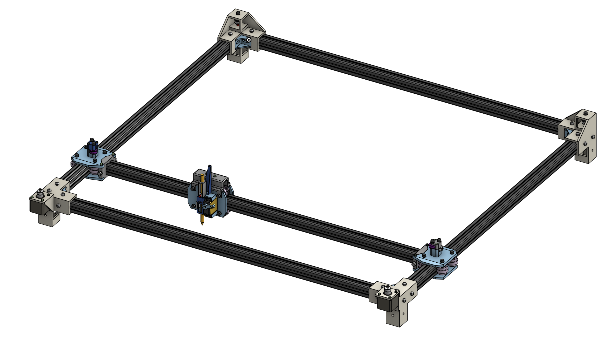
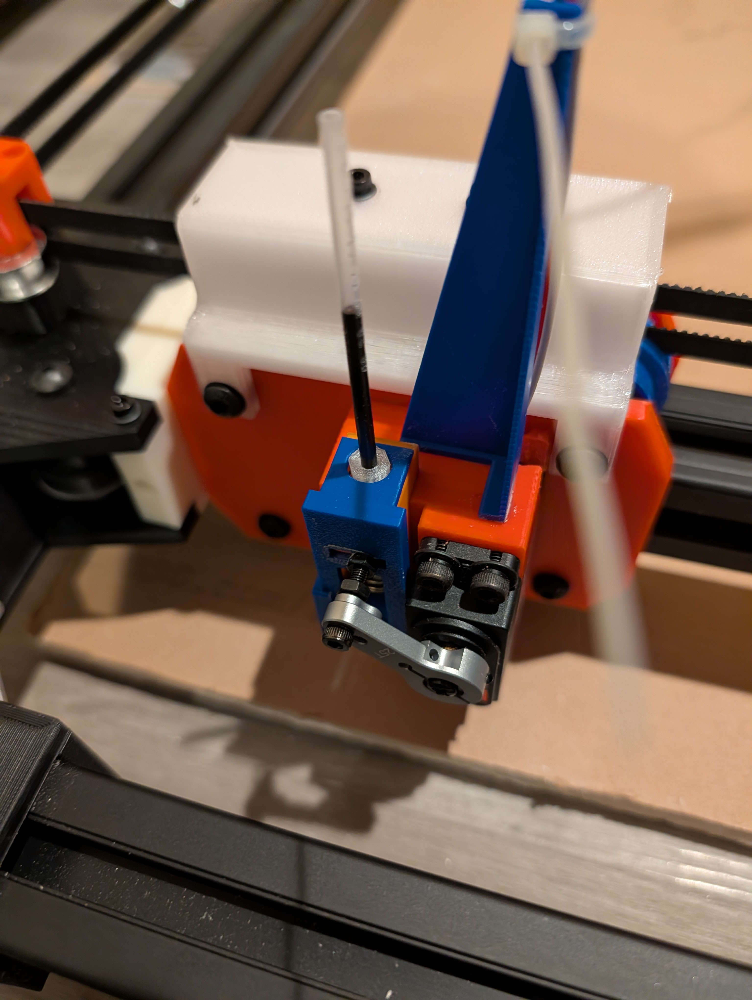

# Assembly Guide

This guide explains the current build details for the CoreXY pen
plotter. The CAD and BOM remain the source of truth for mechanical part shapes
and counts; this file records the build order, electronics, wiring, and first
motion checks.

If you are building this and get stuck, feel free to reach out:
bcliu09@gmail.com.

## Mechanical Build

CAD reference render:



Reference the Onshape assembly while building. The exported files are useful for
printing, but the Onshape assembly is still the easiest way to check how parts
are supposed to sit relative to each other.

1. Start the motor-side half of the frame. Push the uncut 1 meter length
   extrusions fully into the motor mount brackets, one on each side. Slide in the
   T-nuts needed to secure each extrusion to its corner bracket. Add an aluminum
   corner bracket into each corner now, while the corner is still easy to reach,
   and make sure each bracket sits snugly in the corner.
2. Take another extrusion for the width piece between the two motor corner
   mounts. Load the correct number of T-nuts into it before closing the frame.
   When this width extrusion is installed, it should not occupy the corner cube;
   the length extrusions should occupy that space. Tighten the M6 x 12 bolts into
   the T-nuts and through the aluminum corner brackets.
3. At this point, the frame should look like a U shape. Next, cut the gantry
   extrusion. Cut 58.2 mm off a full 1 meter extrusion. Cutting a little too much
   is better than cutting too little, because an oversized gantry extrusion will
   fight the carts and make assembly harder. Once the gantry is cut, take the two
   cart-cart plates and press or lightly hammer them onto each side.
4. Pre-assemble the Y carts before sliding the gantry into the full frame. Before
   doing the rollers, assemble the upper mold/idler section. Insert the M5 screws
   into the upper mold, add the thin 0.5 mm and 1 mm printed spacers where they
   belong, add the idler pulleys, pass the screws through the cart top plate, and
   secure them with M5 nuts. The extra M3 holes on the Y carts can be mounted if
   you want more rigidity.
5. Build the rollers between the cart top and bottom plates. Starting from the
   top plate, load each M5 screw with a washer, add the cart-to-bearing spacer,
   add a 625 bearing, add the printed surface roller, add the bearing-to-bearing
   internal spacer, add the second 625 bearing, then add the outside
   cart-to-bearing spacer. Repeat this stack for all rollers, then close the cart
   with M5 nuts.
6. Repeat the Y-cart assembly for both sides. Then mesh the cart-cart plates on
   the gantry extrusion with the two Y carts and slide the whole gantry/Y-cart
   assembly onto the frame.
7. Assemble the two identical far-side/back corner brackets. For each pulley
   stack, insert the M5 screw with washer, then stack the upper spacer, toothed
   idler, middle spacer, toothed idler, and bottom spacer. Put the M5 nut into
   the extrusion groove and tighten the stack enough to hold it, but loose enough
   that the pulleys can still spin freely. Do this for both far-side brackets.
8. Take a full 1 meter width extrusion, load its T-nuts, and mount the two
   far-side corner brackets onto each end. Again, do not slide this width
   extrusion into the corner cube; that space is for the length extrusions that
   will slide in next. Before closing the frame, add the aluminum corner brackets
   onto this width extrusion using the M6 x 12 bolts and the loaded T-nuts. After
   this, there should be a clean square opening down through each corner bracket
   where the length extrusion can enter.
9. Load the correct number of T-nuts onto the left and right length extrusions.
   Carefully slide both length extrusions into the far-side corner bracket holes
   at the same time, inching each side forward evenly so the frame does not twist.
   Make sure the gantry assembly is already on the length extrusions before the
   far side is closed. A light hammer tap may be needed to get the fit snug.
10. Install the M3 rigidity screws and washers that connect the cart-cart plates
    to the Y carts. Tighten all remaining M6 x 12 frame bolts. The frame should
    now feel rigid. Mount the two NEMA 17 motors using M3 x 10 screws and washers.
11. Pre-assemble the toolhead. First mount the servo with four M3 screws. Then
    take the two toolhead plates and use the same roller-stack process to mount
    the two bottom rollers. From the side, the partial toolhead assembly should
    look like a U shape that can slide onto the gantry.
12. Route the belts before fully closing the toolhead. Take one 5 meter belt, run
    it through its CoreXY layer, and bring both belt ends to the middle of the
    gantry. Cut it so there is about 1 cm of gap between the two ends. Repeat for
    the second belt layer. Use the belt clamp mount, aluminum belt clamps, and M4
    screws to pin the belts down. Tension both belts evenly. Do this while the
    gantry is pushed against an edge so the frame is held rectangular while the
    belts are tightened. Once the belts are clamped, use M3 screws to mount the
    belt clamp mount onto the large U-shaped toolhead mount.
13. Slide the partially assembled toolhead onto the gantry from the bottom and
    align it with the belt mount. Pre-assemble each modified roller with a
    bearing-to-bearing spacer sandwiched between two 625 bearings. Then use
    tweezers to push the M5 screw through the top belt mount, the cart plate, a
    cart-to-bearing spacer, the modified roller, another cart-to-bearing spacer,
    the other cart plate, the lower belt mount, and finally into an M5 nut. Repeat
    this for both upper rollers.
14. Assemble the pencil mount. Put the pencil block into the pencil housing, add
    the spring, install the cap, and slide the housing into place. Push an M3
    screw through the outer hole of the servo horn and into the horizontal groove
    of the pencil housing cap. Use two nuts to lock this M3 screw so it holds the
    cap position. Super glue the small slider securer near the bottom of the left
    side of the slider rail, but do not glue it to the moving pencil housing.
    Finally, glue the servo wire aligner so the servo wire exits vertically, then
    use the zip tie to lock the wire down.

Toolhead detail:



15. Wire the motors by plugging the NEMA 17 four-pin connectors into the X and Y
    driver sockets on the CNC shield. For the servo, chain jumper wires together
    so the servo lead can reach the electronics. In this build, the best solution
    was to make a simple overhead support, like a tripod or suspended arm, that
    holds the servo wire above the center of the machine. The wire should be able
    to reach all four corners without sagging into the belts or onto the paper.
16. Set the DRV8825 current limit to about 0.45-0.5A before serious motion
    testing. If you have not adjusted DRV8825 current before, look up the current
    limit procedure for your exact driver board and measure carefully. After the
    drivers are set, install their heatsinks, place the drivers into the CNC
    shield in the correct orientation, and plug the shield onto the Arduino Uno.
    Wire the servo and external 5V supply using the servo anti-twitch circuit
    described below.


## Electronics

Current electronics:

```text
Arduino Uno
CNC Shield V3
DRV8825 stepper drivers
two NEMA 17 stepper motors
servo for pen lift
external motor power supply for CNC shield
external 5V supply for servo
IRLZ44N N-channel MOSFET for servo power switching
```

Reference overview of the current electronics setup:


## CNC Shield Wiring

Stepper mapping:

```text
CNC Shield X driver socket = CoreXY motor A
CNC Shield Y driver socket = CoreXY motor B
```

Arduino/CNC shield pin mapping:

```text
D2  = X step = CoreXY motor A step
D3  = Y step = CoreXY motor B step
D5  = X dir  = CoreXY motor A dir
D6  = Y dir  = CoreXY motor B dir
D8  = stepper enable, active LOW
D11 = Z-limit signal, servo power MOSFET gate
D12 = SpnEn, servo signal
```

The firmware assumes DRV8825 drivers are configured for `1/32` microstepping:

```text
GT2 belt
20 tooth pulley
1.8 degree stepper motor
1/32 microstepping
160 steps/mm
```

## Servo Anti-Twitch Power Wiring

The servo is powered through an IRLZ44N N-channel MOSFET so it stays off during
Arduino boot/reset. This avoids the startup twitch that happened when the servo
received unstable power or signal during boot.

Breadboard reference for the servo/transistor wiring:


With the IRLZ44N front/text side facing you and legs pointing downward:

```text
left pin   = gate
middle pin = drain
right pin  = source
```

Wire the servo power circuit like this:

```text
Servo red wire       -> external 5V +
Servo brown/black    -> IRLZ44N drain
IRLZ44N source       -> external 5V GND
IRLZ44N source       -> Arduino/CNC shield GND
Servo orange/yellow  -> CNC shield SpnEn / Arduino D12
CNC shield D11       -> 220 ohm resistor -> IRLZ44N gate
IRLZ44N gate         -> 10k ohm pulldown resistor -> GND
```

All grounds must be common:

```text
Arduino/CNC shield GND
external servo 5V supply GND
IRLZ44N source
motor supply ground, if the supply setup exposes a common ground point
```

Optional signal pulldown:

```text
D12 / SpnEn servo signal -> 10k ohm resistor -> GND
```

Optional signal protection:

```text
D12 / SpnEn -> 1k ohm resistor -> servo signal wire
```

The required anti-twitch part is the gate pulldown:

```text
IRLZ44N gate -> 10k ohm resistor -> GND
```

The firmware starts with servo power off:

```cpp
pinMode(SERVO_POWER_PIN, OUTPUT);
digitalWrite(SERVO_POWER_PIN, LOW);
```

When a pen command is sent, the firmware writes the target up position, attaches
the servo signal, waits briefly, turns on MOSFET power through `D11`, then moves
the servo. When servo power is turned off, the firmware moves the pen up, turns
off MOSFET power, then detaches the servo signal.

## Machine Coordinates

The plotter uses machine coordinates:

```text
X0 Y0     = bottom-left manual home
X203 Y185 = center
X406 Y370 = far corner
```

Do not treat `0,0` as the center. The known-good firmware assumes bottom-left is
home.

Current soft limits:

```text
X_MAX = 406.0 mm
Y_MAX = 370.0 mm
```

## First Power-On Checks

Before uploading or moving:

1. Confirm the DRV8825 drivers are oriented correctly on the CNC shield.
2. Confirm the motor power supply voltage and polarity.
3. Confirm the servo external 5V polarity.
4. Confirm the Arduino/CNC shield ground and servo supply ground are common.
5. Confirm the MOSFET gate has the 10k pulldown to ground.
6. Confirm the servo red wire is not powered from the Arduino 5V pin.
7. Confirm the gantry can travel across the full drawing area without binding, rubbing, or pulling wires tight.

Then upload the firmware:

```bash
cd firmware
pio run -e uno -t upload
```

Open the serial monitor:

```bash
cd firmware
pio device monitor -e uno
```

Manual homing sequence:

```text
moff
```

Move the gantry/toolhead by hand to the bottom-left corner.

```text
mon
h
p
```

Basic servo test:

```text
u
d
u
soff
```

Basic motion test:

```text
g 203 185
g 0 0
```

If center is correct, test the far corner carefully:

```text
g 406 370
```

## Serial Commands

```text
?              show help
h              set current position as X0 Y0
p              print current position and settings
r dx dy         relative move in mm, example: r 10 0
g x y           absolute move in mm, example: g 203 185
c x y radius    draw circle, example: c 203 185 40
l xmax ymax     set soft limits, example: l 406 370
s fastDelay     set top-speed step delay, example: s 50
accel n         set acceleration in steps/sec^2, example: accel 10000
mon             enable stepper drivers
moff            disable stepper drivers
son             servo power on
soff            servo power off
u               pen up
d               pen down
a angle         servo angle, example: a 100
test            servo power on, up, down, up, off
```

Lower `s` values are faster because the command controls the top-speed step
delay in microseconds. The current prototype firmware blocks values below `1`.

Motion uses an acceleration-limited curve. Short moves automatically stay slower
if there is not enough distance to accelerate and decelerate gently.

## Sending A G-code File

Launch Plotter Studio:

```bash
cd firmware
python3 -m venv .venv
.venv/bin/python -m pip install -r tools/requirements.txt
.venv/bin/python tools/plotter_studio.py
```

Then open `http://127.0.0.1:8765`.

Send the square smoke test:

```bash
cd firmware
pio run -e uno -t upload && .venv/bin/python tools/send_gcode.py --confirm-home examples/square.gcode
```

The sender prompts you to manually place the toolhead at bottom-left home before
it sends the `G28 P1` home-confirmation command.
